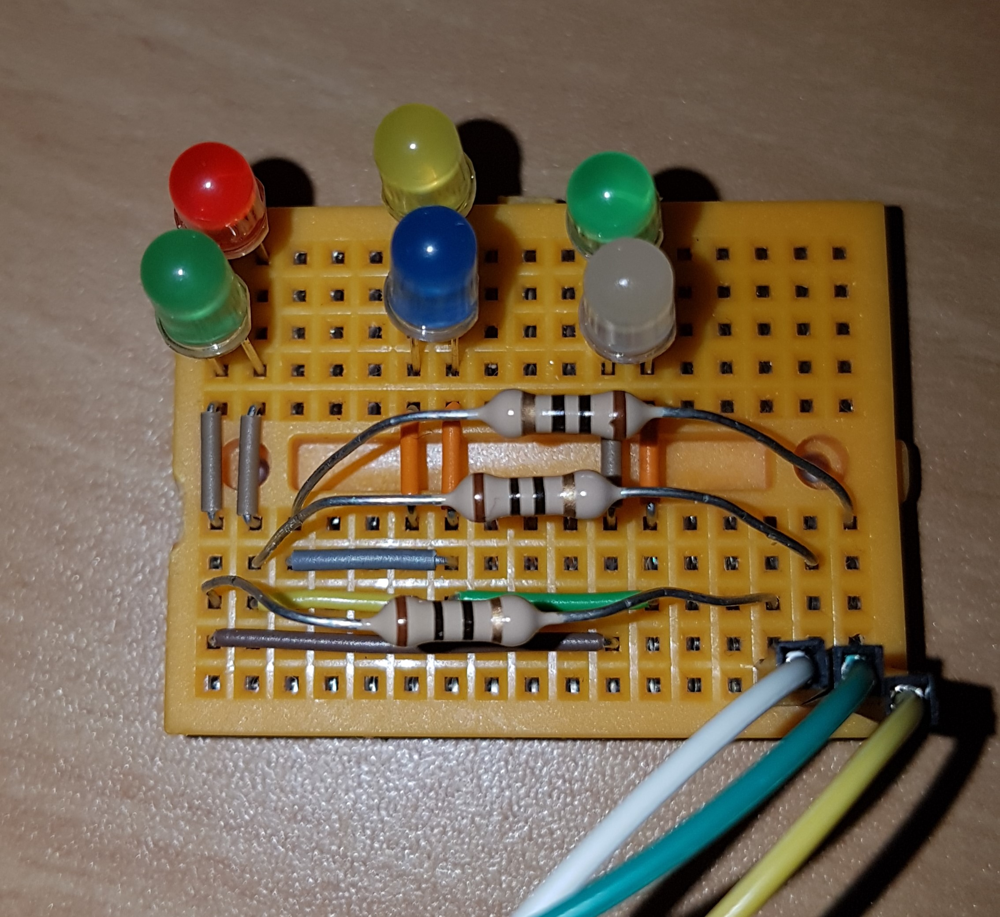

# Charlieplexing with ESP32

In this example, I am using three GPIO pins on an ESP32 to control six LEDs via Charlieplexing. The **sketch** demonstrates three different methods to control the GPIO pins, highlighting their performance differences. A breadboard layout with six LEDs connected to the three ESP32 pins is shown below:

The white wire connects to GPIO16, the green wire to GPIO17, and the yellow wire to GPIO18 of the ESP32.

## What is Charlieplexing?

Charlieplexing is a technique that allows controlling multiple LEDs with fewer GPIO pins than normally required. It works by utilizing the high-impedance state of microcontroller pins to control multiple LEDs with just a few GPIOs. Although only one LED can be on at a time, rapidly switching them creates the illusion that multiple LEDs are lit simultaneously.

For more details, see [Charlieplexing](https://en.wikipedia.org/wiki/Charlieplexing) on Wikipedia.

## Testing Without Hardware and Arduino IDE

You can test the sketch without using the Arduino IDE or physical hardware by using the Wokwi simulator. Use the simulator at this [link](https://wokwi.com/projects/new/esp32).

1. Copy the sketch into the simulator's [sketch.ino](FastGPIOtest.ino) tab.
2. Copy this [diagram.json](wokwi/WokWi_diagram.json) file into the simulator's `diagram.json` tab.

Make sure you copy the entire JSON code, including the outer curly brackets, as they may not always be visible in a browser window.

The `diagram.json` defines the hardware, including the ESP32, a breadboard, six LEDs, and three resistors.

**Important:** After copying the sketch into the simulator, change the line `#define MESSURELOOPS` to 0. This skips the measurement steps in the `setup()` function; otherwise, the sketch will take a long time measuring the speed of the functions.

Once this is done, press the play button, and the sketch will run in the simulator. Keep in mind that the simulator runs slower than real hardware.

## Prerequisites

- ESP32 (any version should work)
- Arduino IDE (tested with version 2.3.2)
- 6 LEDs and 3 resistors (I used 10 Ohm resistors)
- Breadboard (optional)
- Jumper wires (optional)

## Sketch Features

This sketch demonstrates Charlieplexing by controlling six LEDs using three GPIO pins. Since speed is important in Charlieplexing (to create the illusion of multiple LEDs being on), the sketch implements three methods to control the GPIO pins. These methods are designed to compare performance, focusing on execution speed.

1. **Method 0**:
   Uses the standard `pinMode` and `digitalWrite` functions. This is the default, high-level Arduino approach, but it is relatively slow.

2. **Method 1**:
   A more efficient method using the `gpio_config` function from the ESP32 Hardware Abstraction Layer (HAL). This provides a significant speed improvement over Method 0.

3. **Method 2**:
   The fastest method, utilizing low-level ESP32 GPIO functions such as `gpio_set_level` and `gpio_set_direction`. This method interacts directly with the hardware registers, minimizing overhead.

### Performance Comparison

In the `setup()` function, each method is tested, and its performance is measured in microseconds using the ESP32's `micros()` function. The results for both the `AllOff` and `LitLed` operations are printed to the serial monitor for comparison.

### Setup and Usage

1. Connect the ESP32 to your circuit (see the [Breadboard Design](./images/BreadboardDiagram.jpg) and the [Schematic on Wikipedia](https://en.wikipedia.org/wiki/Charlieplexing#/media/File:3-pin_Charlieplexing_with_common_resistors.svg)). Use the GPIO pins defined in the sketch (`display_pins`).
2. Upload the sketch to your ESP32 using the Arduino IDE.
3. Open the serial monitor to view the LED sequence and speed test results.

### What the Sketch Does

The sketch first lights up each LED individually to verify the connections. Then, it measures and prints the time taken by each method to turn off all LEDs and light one up.

In the `loop()`, LEDs are lit up in alternating groups of three, with the method used to control the GPIOs switching after each cycle.

## License

This code is open-source and available under the MIT License. Feel free to modify and use it for your own projects.
